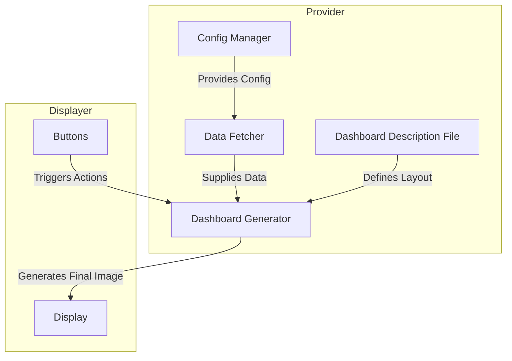
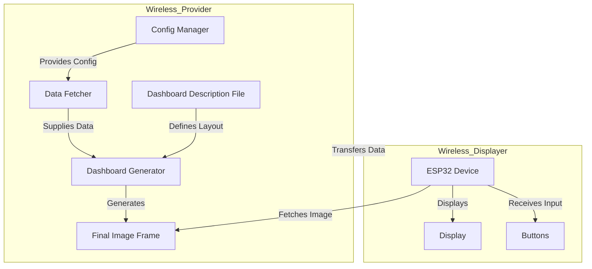

# CardanoTicker Software Components Architecture

## Overview
The **CardanoTicker** integrates hardware and software to display blockchain data on e-ink or LCD screens. Its architecture is designed for modularity, enabling dynamic updates and user interaction via buttons.

## Software Components

### 1. Config Manager
- **Role**: Manages and provides configuration settings.
- **Data Flow**: Interacts with other components to supply necessary configurations.

### 2. Data Fetcher
- **Role**: Fetches and processes data from blockchain APIs.
- **Data Flow**: Supplies parsed data to the Dashboard Generator.

### 3. Dashboard Generator
- **Role**: Combines data, configuration, and a dashboard description file to generate and update the final dashboard image.
- **Data Flow**:
  - Receives configuration from Config Manager.
  - Retrieves data from Data Fetcher.
  - Uses a dashboard description file containing widget types and layout positions to generate the final dashboard.

### 4. Display
- **Role**: Renders visual content for the user.
- **Data Flow**: Receives the final dashboard image from the Dashboard Generator.

### 5. Buttons
- **Role**: Provides interactivity via user input.
- **Data Flow**: Triggers actions in Config Manager and Dashboard Generator.

## Runners

The system operates with two primary runners to handle distinct tasks:

### 1. Provider
- **Purpose**: Acts as the backend service to fetch blockchain data, process it, and prepare it for display.
- **Responsibilities**:
  - Fetches data via APIs using the `Data Fetcher`.
  - Passes data to the `Dashboard Generator` for processing.
- **Execution**:
  - In connected versions, runs on the same device as the Displayer.
  - In wireless versions, runs on a separate machine on the same network.

### 2. Displayer
- **Purpose**: Manages the rendering and user-facing operations of the CardanoTicker.
- **Responsibilities**:
  - Utilizes the `Dashboard Generator` to create the final dashboard image.
  - Sends the image to the `Display` for rendering.
  - Handles user input from the `Buttons` to interact with dashboards.
- **Execution**:
  - Runs on the device connected to the e-ink or LCD display.

## Data Flow Diagram 

## Wireless vs Connected Architecture

### Connected Version
- Both the Provider and Displayer run on the same device.
- Suitable for setups using Raspberry Pi or similar hardware.

### Wireless Version
- The Provider runs on a separate machine (e.g., a server or PC) connected via the same network.
- The Displayer runs on the ESP32 or similar low-power device, fetching processed data from the Provider.

## Summary
The CardanoTicker architecture is modular and extensible, enabling easy updates, efficient data handling, and user-friendly interaction through a clear component flow. The two main runners, the Provider and the Displayer, ensure seamless backend and frontend operations. The `Dashboard Generator` plays a central role, utilizing a dashboard description file to define widget types and layout positions, ensuring flexibility and customization. For connected versions, both runners operate on the same device. In wireless versions, the Provider and Displayer communicate over the network, enhancing flexibility for distributed setups.
