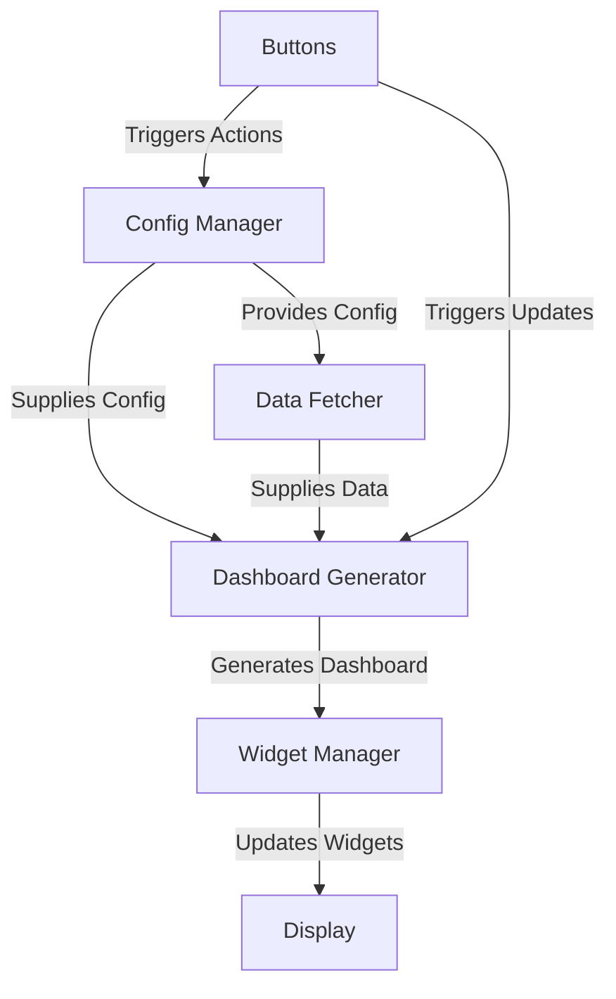
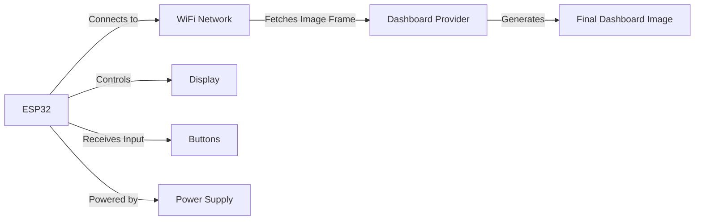

# CardanoTicker Software Components Architecture

## Overview
The **CardanoTicker** integrates hardware and software to display blockchain data on e-ink or LCD screens. Its architecture is designed for modularity, enabling dynamic updates and user interaction via buttons.

## Software Components

### 1. Config Manager
- **Role**: Manages and provides configuration settings.
- **Data Flow**: Interacts with other components to supply necessary configurations.

### 2. Data Fetcher
- **Role**: Fetches and processes data from blockchain APIs.
- **Data Flow**: Supplies parsed data to the Dashboard Generator.

### 3. Dashboard Generator
- **Role**: Combines data and configuration to generate and update dashboards.
- **Data Flow**: Interacts with Config Manager, Data Fetcher, and Widget Manager.

### 4. Widget Manager
- **Role**: Manages individual dashboard widgets.
- **Data Flow**: Sends rendering updates to the Display.

### 5. Display
- **Role**: Renders visual content for the user.
- **Data Flow**: Receives processed outputs from the Widget Manager.

### 6. Buttons
- **Role**: Provides interactivity via user input.
- **Data Flow**: Triggers actions in Config Manager and Dashboard Generator.

## Data Flow Diagram

## Wireless Build Architecture
For wireless builds using the ESP32:

## Summary
The CardanoTicker architecture is modular and extensible, enabling easy updates, efficient data handling, and user-friendly interaction through a clear component flow.
